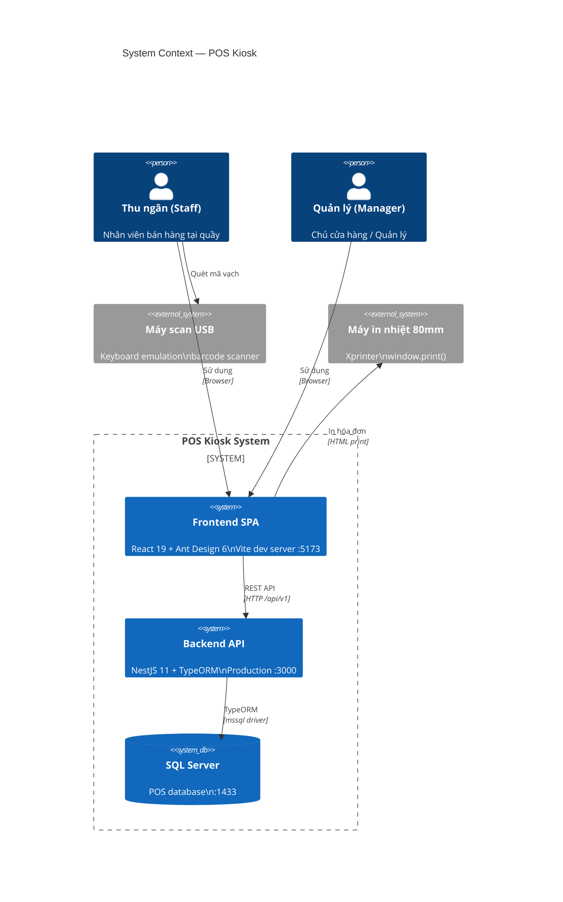
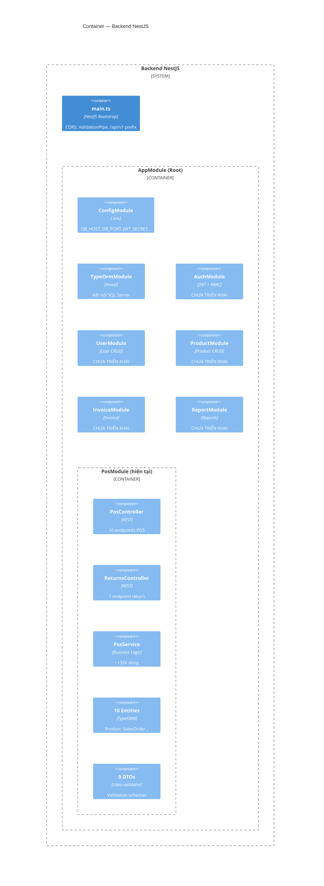
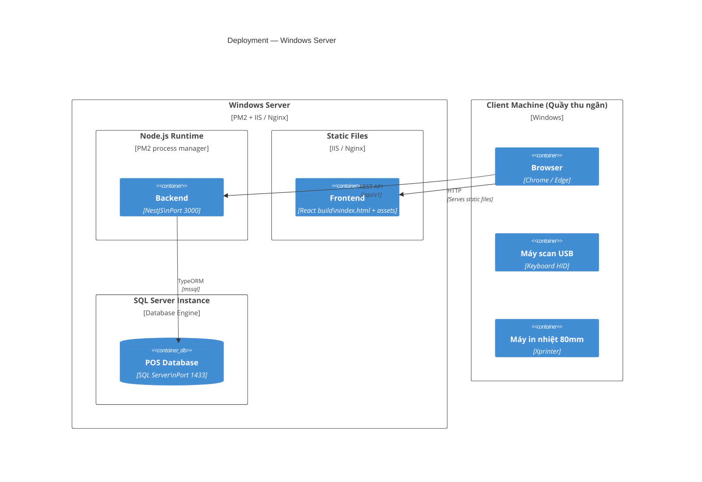
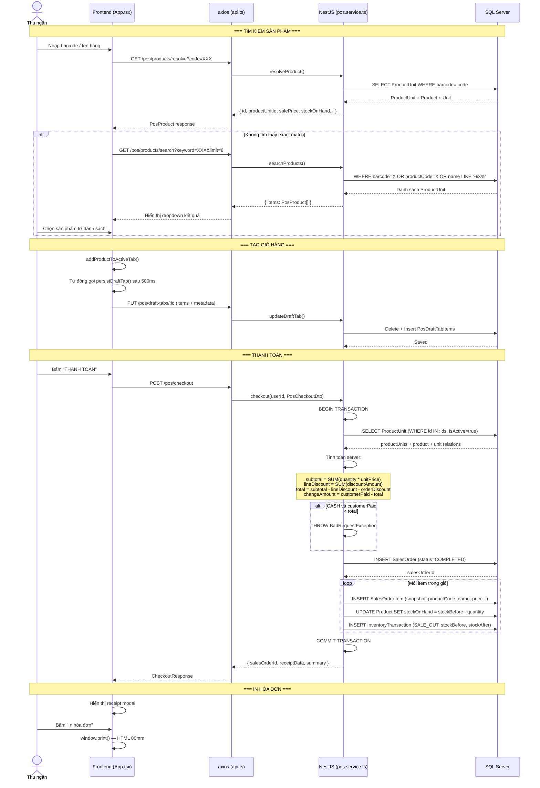
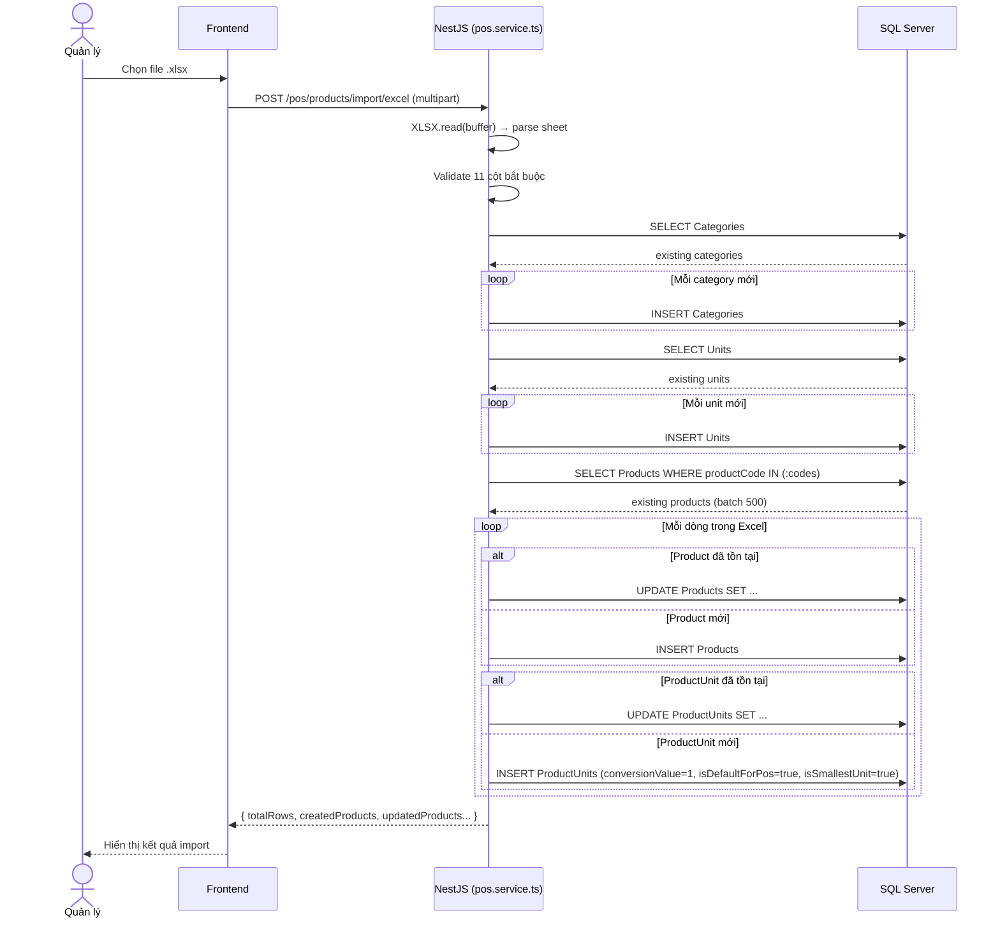
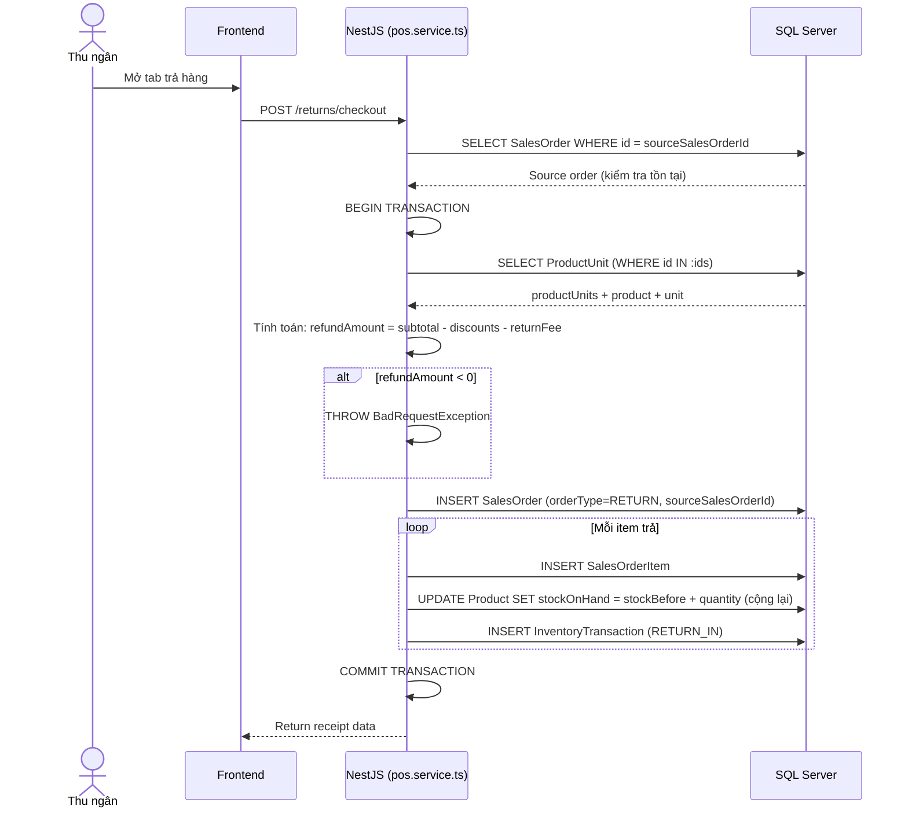
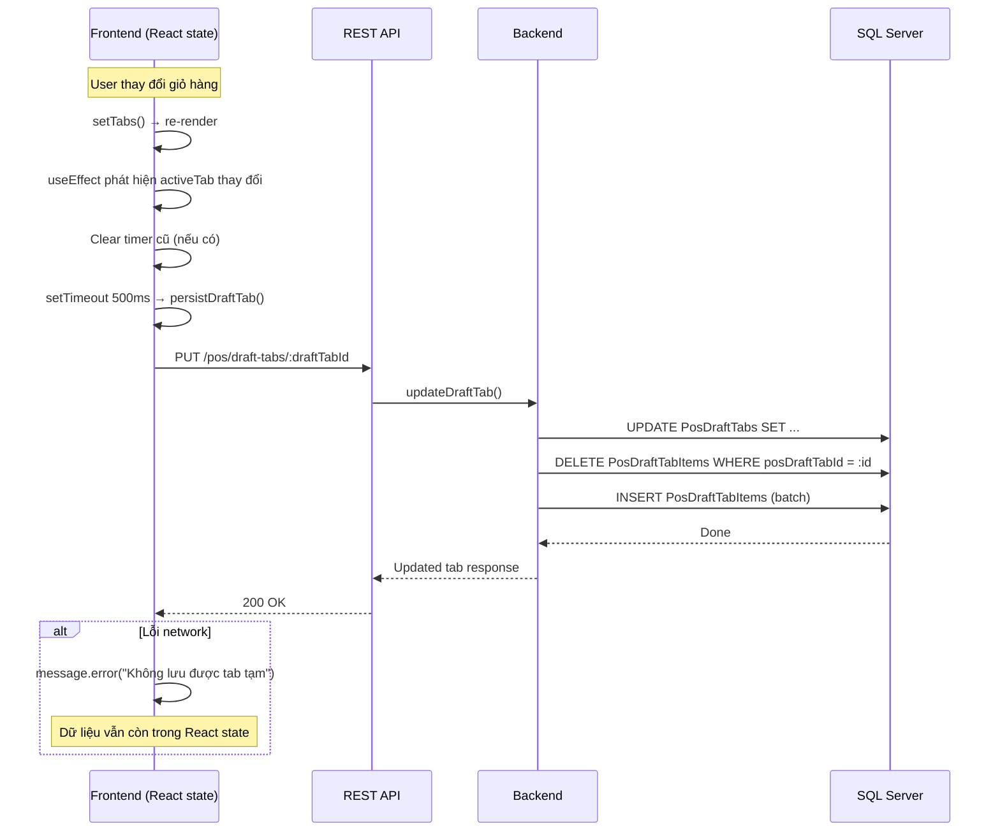
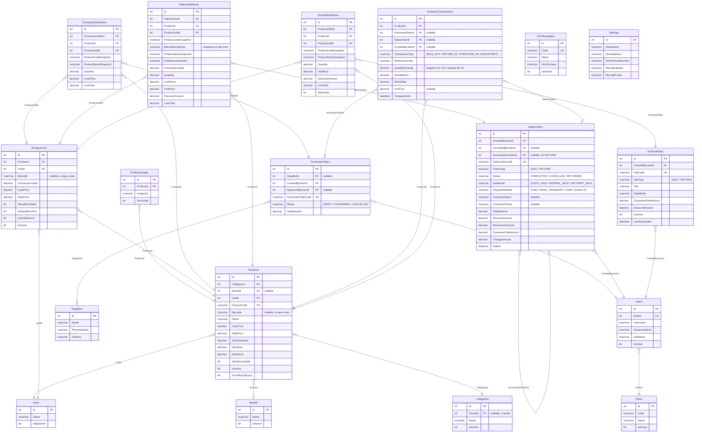
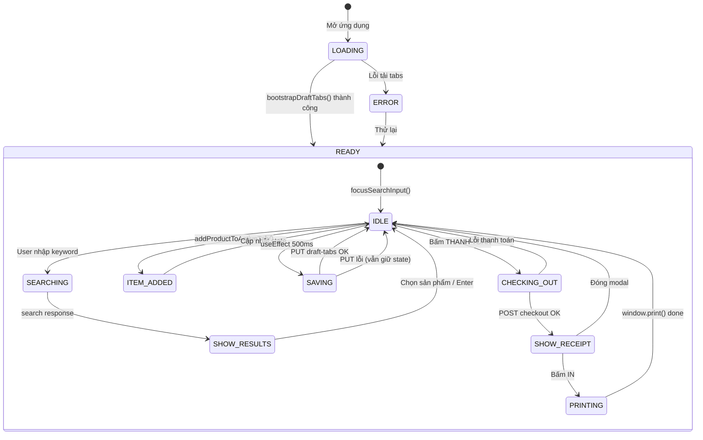
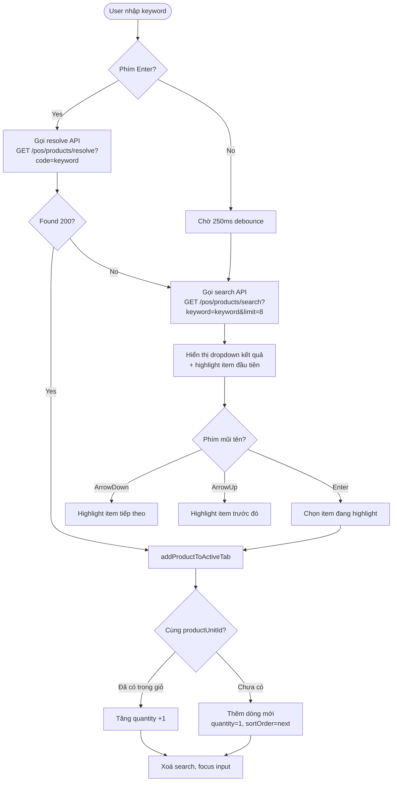

# Architecture — POS Kiosk

## 1. System Context (C4 - Level 1)



## 2. Container Diagram (C4 - Level 2)



## 3. Deployment Diagram (C4 - Level 3)



## 4. Luồng Xử Lý Chính

### 4.1 POS Checkout (Bán hàng)



### 4.2 Import Excel



### 4.3 Return Checkout (Trả hàng)



### 4.4 Draft Tab Auto-Save



## 5. Kiến Trúc Database — Entity Relationship



## 6. Luồng Middleware / Interceptor

```mermaid
flowchart LR
  subgraph Request
    REQ[HTTP Request]
  end

  subgraph NestJS Pipeline
    direction TB
    CORS[CORS middleware] --> Validation[ValidationPipe<br/>global]
    Validation --> Controller[Controller<br/>route handler]
    Controller --> Service[Service<br/>business logic]
    Service --> TypeORM[TypeORM<br/>Repository / QueryBuilder]
  end

  subgraph Response
    RES[JSON Response<br/>{ success, message, data }]
  end

  REQ --> CORS
  TypeORM -->|SQL| DB[(SQL Server)]
  DB --> TypeORM
  Service --> RES

  style CORS fill:#e1f5fe
  style Validation fill:#e1f5fe
  style DB fill:#f3e5f5
```

## 7. State Management — Frontend (App.tsx)



## 8. Product Search Strategy



## 9. Inventory Transaction Types

```mermaid
flowchart TD
  subgraph Legend
    IN(("+")), OUT(("-"))
  end

  INITIAL[INITIAL_IMPORT] -->|Cộng tồn| IN_P(Product.StockOnHand +)
  PURCHASE[PURCHASE_IN] -->|Cộng tồn| IN_P
  RETURN_IN[RETURN_IN<br/>Trả hàng] -->|Cộng tồn| IN_P
  CANCEL_SALE_IN[CANCEL_SALE_IN<br/>Hủy hóa đơn] -->|Cộng tồn| IN_P
  ADJUST_IN[ADJUSTMENT_IN<br/>Kiểm kê tăng] -->|Cộng tồn| IN_P

  SALE_OUT[SALE_OUT<br/>Bán hàng] -->|Trừ tồn| OUT_P(Product.StockOnHand -)
  ADJUST_OUT[ADJUSTMENT_OUT<br/>Kiểm kê giảm] -->|Trừ tồn| OUT_P

  IN_P --> AUDIT[InventoryTransactions<br/>stockBefore / stockAfter
  referenceCode = SalesOrderCode]
  OUT_P --> AUDIT
```

## 10. Cấu Trúc Response JSON

```mermaid
flowchart LR
  subgraph Success
    S1[success: true]
    S2[message: "OK"]
    S3[data: {...}]
  end

  subgraph Error
    E1[success: false]
    E2[message: "Validation failed"]
    E3[errors: [...]]
  end

  subgraph ErrorItem
    E3a[field: "items[0].quantity"]
    E3b[message: "Quantity must > 0"]
  end

  E3 --> E3a
  E3 --> E3b
```

## 11. Checkout — Server-Side Calculation

```mermaid
flowchart TD
  START_CHECKOUT([POST /pos/checkout]) --> VALIDATE{items.length > 0?}
  VALIDATE -->|No| ERR1[400 Cart is empty]
  VALIDATE -->|Yes| FETCH[DB: SELECT ProductUnit<br/>WHERE id IN :ids AND isActive=true<br/>JOIN Product + Unit]

  FETCH --> MAP[Tạo Map<productUnitId, ProductUnit>]
  MAP --> LOOP_ITEMS

  subgraph LOOP_ITEMS[Với mỗi item trong payload]
    direction TB
    CHECK_MAP{productUnitMap.has(id)?}
    CHECK_MAP -->|No| ERR2[400 Invalid product unit]
    CHECK_MAP -->|Yes| CHECK_ACTIVE{product.isActive<br/>& allowDirectSale?}
    CHECK_ACTIVE -->|No| ERR3[400 Product inactive]
    CHECK_ACTIVE -->|Yes| CALC[grossAmount = qty * unitPrice<br/>lineTotal = grossAmount - discountAmount]
    CALC --> CHECK_NEG{lineTotal < 0?}
    CHECK_NEG -->|Yes| ERR4[400 Invalid line total]
    CHECK_NEG -->|No| ACCUM[subtotal += grossAmount<br/>lineDiscount += discountAmount<br/>itemCount += qty]
  end

  LOOP_ITEMS --> ORDER_DISC[orderDiscountAmount = payload.discountAmount]
  ORDER_DISC --> TOTAL[totalAmount = subtotal - lineDiscount - orderDiscount]
  TOTAL --> CHECK_TOTAL{totalAmount < 0?}
  CHECK_TOTAL -->|Yes| ERR5[400 Invalid total]
  CHECK_TOTAL -->|No| CHECK_CASH{paymentMethod = CASH<br/>& customerPaid < total?}
  CHECK_CASH -->|Yes| ERR6[400 Paid amount insufficient]
  CHECK_CASH -->|No| CHANGE[changeAmount = customerPaid - total]
  CHANGE --> TX_BEGIN[BEGIN TRANSACTION]

  TX_BEGIN --> SAVE_ORDER[INSERT SalesOrder<br/>status=COMPLETED<br/>orderType=SALE]
  SAVE_ORDER --> SAVE_ITEMS

  subgraph SAVE_ITEMS[Với mỗi normalizedItem]
    direction TB
    SI1[INSERT SalesOrderItem<br/>code/name/price snapshot]
    SI2[UPDATE Product.stockOnHand -= qty]
    SI3[INSERT InventoryTransaction<br/>type=SALE_OUT<br/>stockBefore / stockAfter]
  end

  SAVE_ITEMS --> TX_COMMIT[COMMIT TRANSACTION]
  TX_COMMIT --> RESPONSE

  subgraph RESPONSE[Return]
    R1[salesOrderId]
    R2[salesOrderCode: HD{id}]
    R3[receiptData: store info + items]
    R4[summary: totals + change]
  end

  ERR1 --> BAD_RESPONSE[400 BadRequestException]
  ERR2 --> BAD_RESPONSE
  ERR3 --> BAD_RESPONSE
  ERR4 --> BAD_RESPONSE
  ERR5 --> BAD_RESPONSE
  ERR6 --> BAD_RESPONSE
```

## 12. Thư Tự Khởi Tạo Ứng Dụng

```mermaid
flowchart TD
  START([npm run start:dev]) --> NEST[NestFactory.create(AppModule)]

  NEST --> CORS[app.enableCORS<br/>origin: localhost:5173]
  CORS --> PREFIX[app.setGlobalPrefix /api/v1]
  PREFIX --> PIPE[app.useGlobalPipes<br/>ValidationPipe: transform, whitelist, forbidNonWhitelisted]

  PIPE --> LISTEN[app.listen 3000]

  LISTEN --> DB_CONN[TypeORM connects to SQL Server<br/>host: env.DB_HOST / default 10.22.10.22]
  DB_CONN --> MODULES[NestJS loads modules]

  subgraph MODULES[Module initialization]
    CFG[ConfigModule: loads .env]
    TYPEORM[TypeOrmModule: synchronize=false, autoLoadEntities=true]
    POS[PosModule: registers controllers + providers + TypeORM features]
  end

  MODULES --> READY[Server ready on port 3000]
```

## 13. Security Boundary — Kế Hoạch

```mermaid
flowchart TD
  subgraph Client
    BROWSER[Browser]
    LOCAL_STORAGE[JWT Token<br/>localStorage]
  end

  subgraph Server
    AUTH_MID[JwtAuthGuard<br/>global]
    ROLES_MID[RolesGuard<br/>@Roles decorator]
    VALIDATE[ValidationPipe<br/>class-validator]
    LOGIN[POST /auth/login<br/>username + password]
  end

  subgraph Database
    USERS_TABLE[Users table<br/>PasswordHash: bcrypt]
    ROLES_TABLE[Roles table<br/>MANAGER / STAFF]
  end

  BROWSER -->|"Authorization: Bearer &lt;jwt&gt;"| AUTH_MID
  AUTH_MID -->|Extract user| ROLES_MID
  ROLES_MID -->|Check role| CONTROLLER[Controller]
  CONTROLLER --> VALIDATE

  LOGIN -->|Verify| USERS_TABLE
  USERS_TABLE -->|"bcrypt.compare()"| LOGIN
  LOGIN -->|Sign JWT| BROWSER

  note right of AUTH_MID: CHƯA TRIỂN KHAI<br/>Hiện tại dùng x-user-id header
```
